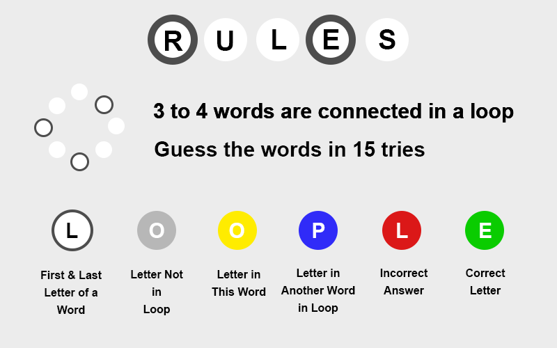
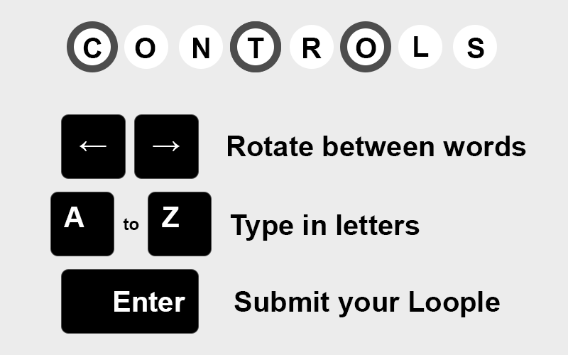

# Loople

Game created for **GMTK Game Jam 2025**, where the theme was "loop." Built using Unity3D, and developed in **under 12 hours**. Ranked **#275 in Creativity** out of 9,655 entries.

## Game Info

## Credits and Special Thanks

- Inspired by *Wordle* by Josh Wardle
- Datasets
    - Electronic Frontier Foundation
        - English Long Word List
        - English General Short Word List
        - English Short Word List
    - Florida State University
        - Basic English 2000 (word list)
